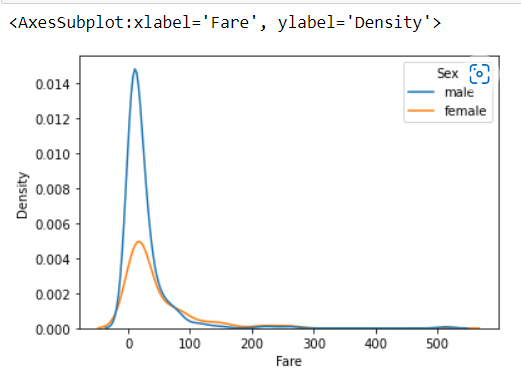

# <p align ='center'> A08-IMPLEMENT KDE PLOT </p>
## Name     : S.SHAM RATHAN
## Reg.no   : 212221230093
## Dept     : AIDS
## Sa Assignment : 08.
-----------------------------------------------------------------------
## Program:
```
import pandas as pd
import numpy as np
import matplotlib.pyplot as plt
import seaborn as sns
df=pd.read_csv("titanic_dataset.csv")
df
#Create KDE for all the numeric variables in dataframe
sns.kdeplot(data=df)
sns.kdeplot(data=df, x='Pclass')
sns.kdeplot(data=df, x='Age')
sns.kdeplot(data=df, x='Fare')
sns.kdeplot(data=df,x='Survived',hue='Sex')
sns.kdeplot(data=df,x='Fare',hue='Sex')
sns.kdeplot(data=df,x='Survived',hue='Age')
sns.kdeplot(data=df,x='SibSp',hue='Age')
sns.kdeplot(data=df,x='Survived',hue='Pclass')
#Stack KDE on a category using MULTIPLE argument
sns.kdeplot(data=df,x='Survived',hue='Sex',multiple='stack')
sns.kdeplot(data=df,x='Survived',hue='Sex',multiple='stack',linewidth=5,palette='Dark2',alpha=0.5)
sns.kdeplot(data=df,x='Fare',hue='Sex',multiple='stack')
sns.kdeplot(data=df,x='Survived',hue='Pclass',multiple='stack')
sns.kdeplot(data=df,x='Survived',hue='Pclass',multiple='stack',linewidth=5,palette='Dark2',alpha=0.5)
sns.kdeplot(data=df,x='Fare',hue='Pclass',multiple='stack')
#Create a bivariate KDE
sns.kdeplot(data=df, x='Survived',y='SibSp')
sns.kdeplot(data=df, x='Survived',y='Fare')
sns.kdeplot(data=df, x='Age',y='Fare')
sns.kdeplot(data=df, x='Age',y='Pclass')
```
## Output:





# <p align ='center'> Thank You </p>


