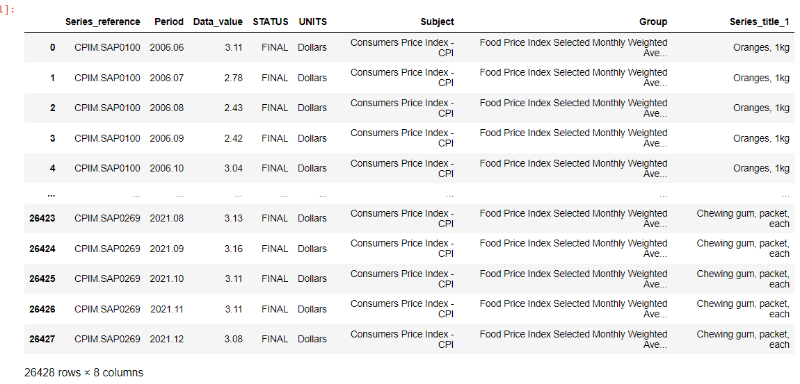

# <p align ='center'> Perform EDA with given Dataset </p>
## Name     : S.SHAM RATHAN
## Reg.no   : 212221230093
## Dept     : AIDS
## Sa Assignment : 04.
-----------------------------------------------------------------------
### Packages:
import pandas as pd
import numpy as np
import seaborn as sns
### Initial DataFrame:
df=pd.read_csv("food-price-index-2021.csv")
df

### Number of Rows and Columns in the DataFrame:
df.info()

### Sum of null data value present in each column:
df.isnull().sum()

### Graphical Representation - Before removing Outliers:
```
df["Data_value"]=df["Data_value"].fillna(df["Data_value"].median())
df.isnull().sum()
df.boxplot()
```

### Statistical Method (IQR) to remove Outliers from Dataset:
```
Q1 = df.quantile(0.25)
Q3 = df.quantile(0.75)
IQR = Q3 - Q1
print(IQR)
df_out = df[~((df < (Q1 - 1.5 * IQR)) |(df > (Q3 + 1.5 * IQR))).any(axis=1)]
print(df_out.shape)
```

### Graphical Representation - After removing Outliers:
df_out.boxplot()

### Infromation on Number of rows and columns after removing Ouliers:
df_out.info()

## EDA
### Insight about data in Column -Series_reference:
```
df["Series_reference"].value_counts()
df_out["Series_reference"].value_counts()
```

### Insight about data in Column -Period :
```
df["Period"].value_counts()
df_out["Period"].value_counts()
```

### Insight about data in Column -Data_value :
```
df["Data_value"].value_counts()
df_out["Data_value"].value_counts()
```

### Insight about data in Column -Series_title_1:
```
df["Series_title_1"].value_counts()
df_out["Series_title_1"].value_counts()
```

### DataSet after removing Outlier
```
df_out
```

### Correlation of columns:
```
df_out.corr()
sns.heatmap(df_out.corr(),annot=True)
df.corr()
sns.heatmap(df.corr(),annot=True)
```

### Analyzation of Column - Data_value:
```
sns.countplot(x="Data_value",data=df_out)
```

### Analyzation of Column - Period:
```
sns.countplot(x="Period",data=df_out)
```

### Non Categorical Data- Distributive Plot:
```
sns.displot(df_out["Period"])
sns.displot(df_out["Data_value"])
```


### Statistical Method - Cross tabulation:
```
pd.crosstab(df_out["Data_value"],df_out["Series_title_1"])
pd.crosstab(df_out["Period"],df_out["Series_title_1"])
```


# <p align ='center'> Thank You </p>


